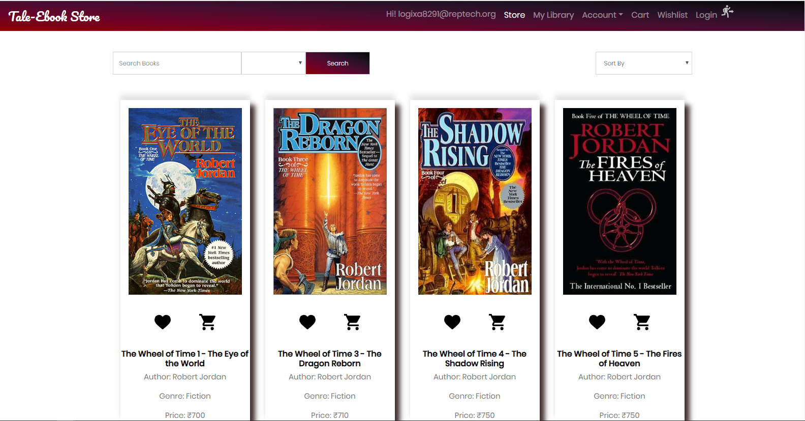

<a href="https://github.com/thatgreenmario/Tale-EbookStore/stargazers"></a>
<a href="https://github.com/thatgreenmario/Tale-EbookStore/issues"></a>
<a href="https://github.com/thatgreenmario/Tale-EbookStore/issues"></a>
[![MIT License][license-shield]][license-url]


<!-- PROJECT LOGO -->
<br />
<p align="center">
  <a href="https://github.com/thatgreenmario/Tale-EbookStore">
    
  </a>

  <h3 align="center">Tale-EbookStore</h3>

  <p align="center">
    E-book Marketplace created using Spring Boot and Angular
    <br />
    <a href="https://github.com/thatgreenmario/Tale-EbookStore"><strong>Explore the docs »</strong></a>
    <br />
    <br />
    <a href="https://github.com/thatgreenmario/Tale-EbookStore">View Demo</a>
    ·
    <a href="https://github.com/thatgreenmario/Tale-EbookStore/issues">Bugs</a>
    ·
    <a href="https://github.com/thatgreenmario/Tale-EbookStore/issues">Request Feature</a>
  </p>
</p>


<!-- TABLE OF CONTENTS -->
## Table of Contents

* [About the Project](#about-the-project)
  * [Built With](#built-with)
* [Getting Started](#getting-started)
  * [Prerequisites](#prerequisites)
  * [Installation](#installation)
* [Screenshots](#usage)
* [Roadmap](#roadmap)
* [Contributing](#contributing)
* [License](#license)
* [Contact](#contact)
* [Acknowledgements](#acknowledgements)


<!-- ABOUT THE PROJECT -->
## About The Project

[![Product Name Screen Shot][product-screenshot]](https://example.com)

Tale is an online shopping system that permits a customer to submit online
orders for e-books from a store that serves online customers. It allows
registered users to view reviews of e-books, add them to cart and purchase
them. They may also add the e-book of their choice to wish list and purchase
later. Upon successful purchase, the e-books will be added to a virtual
library of that particular user to be viewed/downloaded as and when
required.

### Built With

* [Java](https://www.oracle.com/technetwork/java/javase/overview/index.html)
* [Angular](https://angular.io/)
* [Bootstrap](https://getbootstrap.com/)
* [Spring Boot](https://spring.io/)
* [MySQL](https://www.mysql.com/)
* [Maven](https://maven.apache.org/)


<!-- GETTING STARTED -->
## Getting Started

To get a local copy up and running follow these simple steps.

### Prerequisites

* npm
* Java
* Angular 

### Installation

The codes are split into 2 sections.

frontend - Angular 8 Frontend,

backend - Spring Boot Backend ,


 
1. Clone the Tale-EbookStore
```sh
git clone https://github.com/thatgreenmario/Tale-EbookStore.git
```
2. Inside Eclipse or STS
```sh
File -> Import -> Maven -> Existing Maven project
```

Then either build on the command line `./mvnw generate-resources` or using the Eclipse launcher (right click on project and `Run As -> Maven install`) to generate the css. Run the application main method by right clicking on it and choosing `Run As -> Java Application`.

3. Navigate to backend
```sh
http://localhost:5000
```

4. Navigate to Frontend Folder

5. In cmd enter
```sh
ng serve
```
6. Navigate to frontend
```sh
http://localhost:4200
```


<!-- USAGE EXAMPLES -->
## Screenshots

.png)

.png)
.png)
.png)
.png)
.png)
.png)
.png)
.png)
.png)
.png)
<!-- ROADMAP -->
## Roadmap

* Complete Admin Dashboard
* Remove all Bugs


<!-- CONTRIBUTING -->
## Contributing

If you want to contribute to this project you can e-mail me - oj1696@gmail.com or you can pull request.


<!-- LICENSE -->
## License

Distributed under the MIT License. See `LICENSE` for more information.


Project Link: [https://github.com/thatgreenmario/Tale-EbookStore](https://github.com/thatgreenmario/Tale-EbookStore)


<!-- MARKDOWN LINKS & IMAGES -->
<!-- https://www.markdownguide.org/basic-syntax/#reference-style-links -->
[contributors-shield]: https://img.shields.io/badge/Contributers-4-brightgreen
[contributors-url]: https://github.com/thatgreenmario/Tale-EbookStore/graphs/contributors
[forks-shield]: https://img.shields.io/badge/Commits-136-brightgreen
[forks-url]: https://github.com/thatgreenmario/Tale-EbookStore/network/members
[stars-shield]: https://img.shields.io/github/stars/thatgreenmario/Tale-EbookStore
[stars-url]: https://github.com/thatgreenmario/Tale-EbookStore/stargazers
[issues-shield]: https://img.shields.io/github/issues/othneildrew/Best-README-Template.svg?style=flat-square
[issues-url]: https://github.com/thatgreenmario/Tale-EbookStore/issues
[license-shield]: https://img.shields.io/github/license/othneildrew/Best-README-Template.svg?style=flat-square
[license-url]: https://github.com/thatgreenmario/Tale-EbookStore/blob/master/LICENSE
[linkedin-shield]: https://img.shields.io/badge/-LinkedIn-black.svg?style=flat-square&logo=linkedin&colorB=555
[linkedin-url]: https://www.linkedin.com/in/omkar-jadhav-521a23104/
[product-screenshot]: Screenshots/project.png
